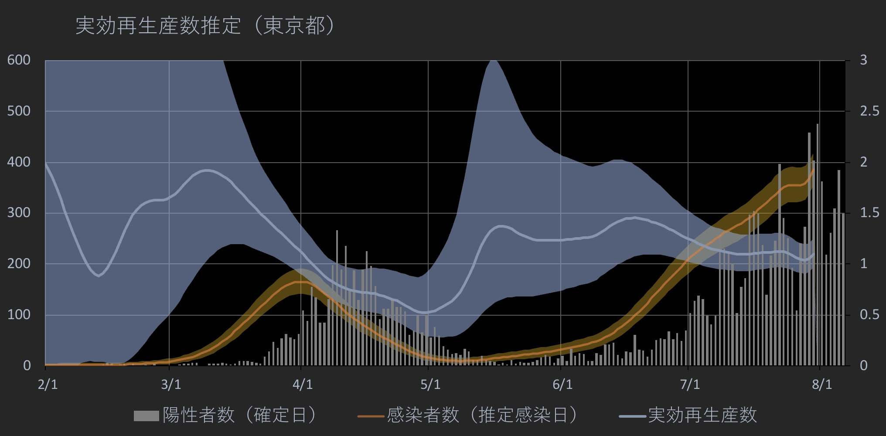
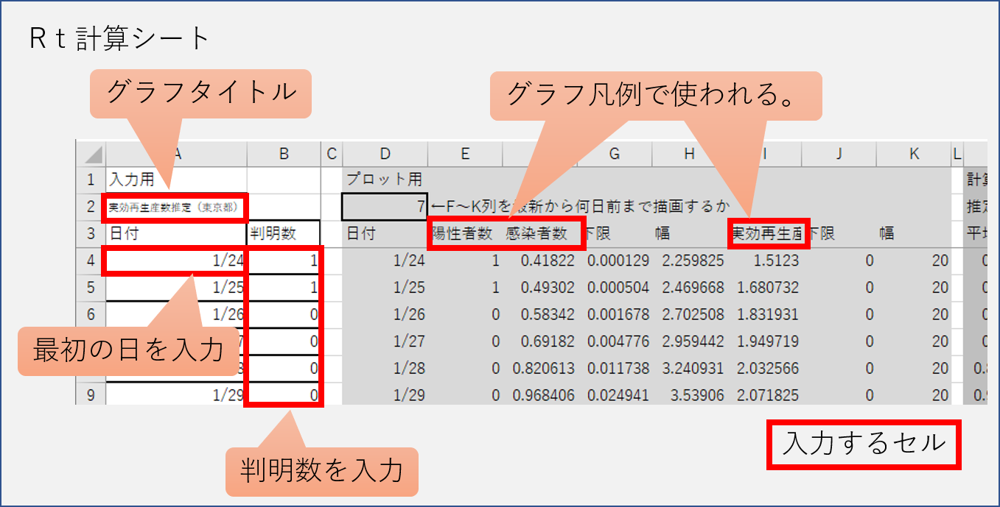
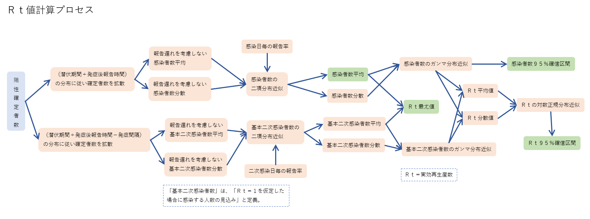

# Rt Calculator Worksheet ver1.2 2020/8/7

## 更新履歴
ver1.2 諸々修正(2020/8/7)  
ver1.1 グラフの描画範囲が自動で設定されるように改良。(2020/8/5)  
ver1.0 初期公開バージョン(2020/7/25)

## 概要
本ファイルは、新型コロナウィルス等の陽性判明数から実効再生産数を計算するためのワークシートです。Excel上での動作を原則としますが、マクロやその他特殊機能を使わずセル間の関係式のみで計算しているため、他の表計算ソフトでも動作する可能性が高いと思われます。（グラフは、エクセル以外で表示が崩れるかもしれません。）

## 使い方

「Rt計算」シートのA4列に日付、B列に陽性判明者数を入力します。B列の4行目以降については、最新の数字より上のセルに0を含めて何らかの数字が入力され、かつそれより後は空欄である必要があります。報告率を考慮するために、最新の数字の位置を特定する目的でこのような仕様になっています。サンプルとして、2020/8/6までの東京都の確定日別陽性者数を入れています。

入力が終わると同時に「グラフ」シートに結果が表示されます。グラフの描画範囲は自動で判定されます。

## 報告遅れ日数分布等の変更
「data」シートには、
* 感染日から報告日（確定日）までの日数の分布（PDF）を0日から順に並べたもの
* 二次感染日から報告日（確定日）までの日数の分布（PDF）を0日から順に並べたもの
* 感染日から報告日（確定日）までの日数の累積分布（CDF）を0日から50日まで順に並べたもの
* 二次感染日から報告日（確定日）までの日数の累積分布（CDF）を-20日から50日まで順に並べたもの

を入力します。すでに入っている値でも分析可能です。違う分布で試したい場合には変更してください。

現在dataシートに入っている値は、Mathematicaにより次のようにして生成されたものです。

    serialIntervalDist =  WeibullDistribution[2.305, 5.452];(*感染から２次感染までの期間*)
    incubationTimeDist = LogNormalDistribution[1.519, .615];(*潜伏期間*)
    onsetToReportDist WeibullDistribution[1.741, 8.573];(*発症から発表までの期間*)
    
    samples = 10000000;
    dist1 = KernelMixtureDistribution[
       RandomVariate[
        TransformedDistribution[x + y, {x \[Distributed] incubationTimeDist, 
          y \[Distributed] onsetToReportDist}], samples]];
    dist2 = KernelMixtureDistribution[
       RandomVariate[
        TransformedDistribution[x + y - z, {x \[Distributed] incubationTimeDist, 
          y \[Distributed] onsetToReportDist, 
          z \[Distributed] serialIntervalDist}], samples]];
    {Table[PDF[dist1][x], {x, 0, 70}], Table[PDF[dist2][x], {x, -20, 50}],
        Table[CDF[dist1][x], {x, 0, 70}], Table[CDF[dist2][x], {x, 0, 70}]} // Transpose;
    Export["data.xlsx", %]

要するに1列目には Serial Interval + Incubation Time のPDF、2列目には Serial Interva  + Incubation Time - Onset To Report のPDF、3列目には1列目のCDF、4列目には2列目のCDFを入力します。

## 計算ロジック

一般的な「報告数の数列を逆畳み込みする」という手法とは異なり、「報告日と各事象間の日数分布に従った数を報告日から引く」ことにより、感染日や2次感染日を推定しています。
https://twitter.com/p_gotcha/status/1278646135309996039
に解説していますが、このワークシートではまた少し異なり、乱数を使わずに計算しています。  

  

モンテカルロ法で計算したものとほぼ一致することは確認していますが、近似を繰り返しているため、報告数が極端に少ない場合には誤差が目立つ可能性があります。（どう計算しても誤差自体は大きくなりますが、誤差の見積もりにずれが出ます。）また、計算の都合上Rtの確信区間の最大値は20でカットしています。グラフの表示範囲を変更する場合には注意してください。

## 著作権等

著作権等に関してはApache License 2.0を適用します。何かで使用された場合は、事後で構いませんので連絡をいただけたら幸いです。

Copyright 2020 Pitchblende(@p_gotcha)

>Licensed under the Apache License, Version 2.0 (the “License”);
>you may not use this file except in compliance with the License.
>You may obtain a copy of the License at
>
>http://www.apache.org/licenses/LICENSE-2.0
>
>Unless required by applicable law or agreed to in writing, software
>distributed under the License is distributed on an “AS IS” BASIS,
>WITHOUT WARRANTIES OR CONDITIONS OF ANY KIND, either express or implied.
>See the License for the specific language governing permissions and
>limitations under the License.
